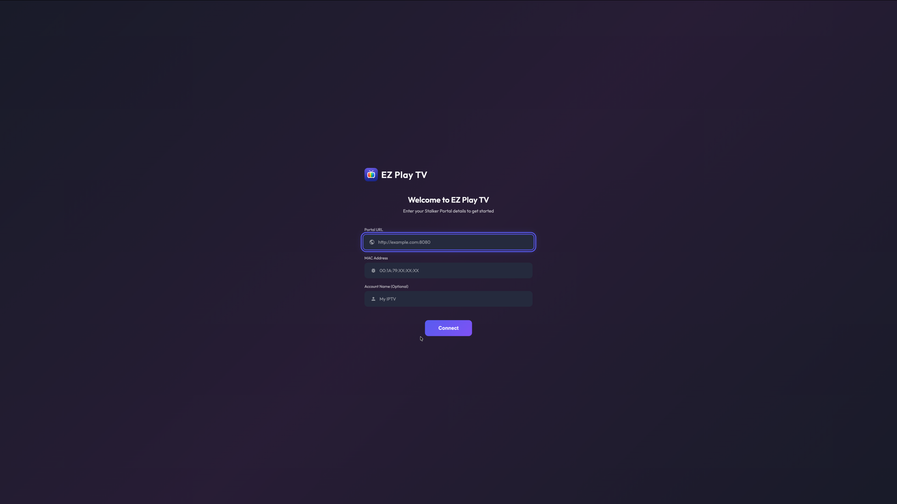
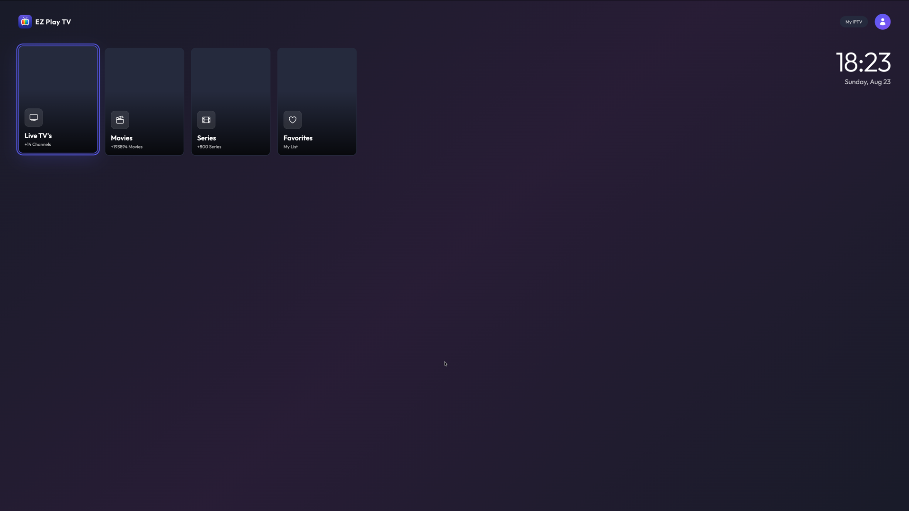
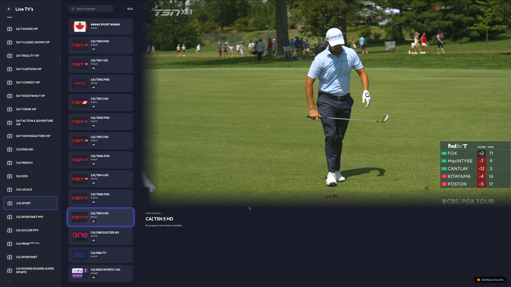
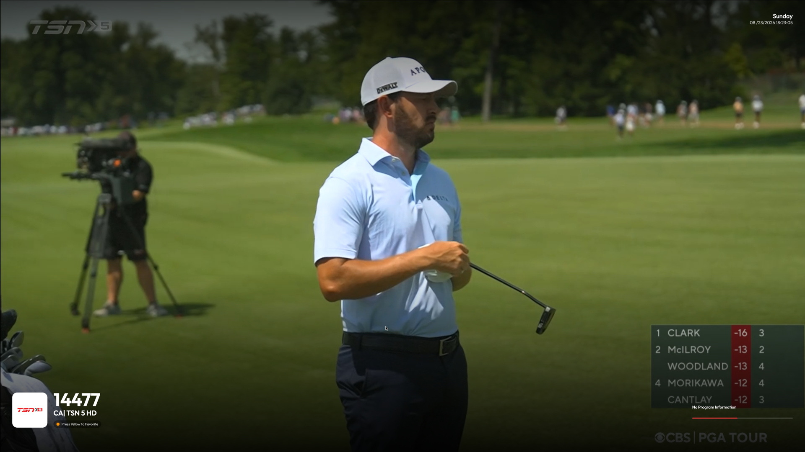

# EZ Play TV - webOS Application

A Stalker Portal IPTV client for LG webOS TVs.

## Screenshots

| Portal setup | Home |
| --- | --- |
|  |  |

| Channel selection and live preview | Full-screen player |
| --- | --- |
|  |  |

## Project Structure

```
ezplaytv-webos-app/
├── appinfo.json          # webOS app manifest
├── index.html            # Main entry point
├── webOSTVjs-1.2.13/     # LG webOSTV.js runtime
├── webos-service/        # Packaged Stalker portal Luna service
├── luna-service/         # Browser-only development proxy
├── css/
│   ├── main.css          # Base styles, variables, common components
│   ├── screens.css       # Setup, Profile, Home, Channels screen styles
│   └── movies-player.css # Movies and Player screen styles
├── js/
│   ├── app.js            # Main application initialization
│   ├── accounts.js       # Account management (localStorage)
│   ├── actions.js        # User interaction handlers
│   ├── data.js           # Sample/mock data
│   ├── navigation.js     # TV remote/keyboard navigation
│   ├── screens.js        # Screen management
│   └── ui.js             # UI rendering functions
└── images/
    ├── icon-80x80.png    # App icon (80x80)
    └── icon-130x130.png  # Large app icon (130x130)
```

## Features

- **Account Management**: Add multiple Stalker Portal accounts
- **Live TV**: Browse channels by country
- **Movies/VOD**: Browse movies by genre
- **TV Remote Navigation**: Full support for D-pad navigation
- **Responsive Playback**: Full-screen video at 1080p and 4K
- **Native webOS Networking**: Packaged Luna service avoids browser CORS restrictions

## Navigation

- **Arrow Keys**: Navigate between focusable elements
- **Enter/OK**: Select/activate focused element
- **Back/Escape**: Go back to previous screen
- **Green Button on Home**: Reconnect and refresh categories/content
- **Yellow Button**: Add or remove the focused item from favorites

### Zone-Based Navigation

The app uses intelligent zone-based navigation:
- Sidebar: Up/Down navigates within sidebar, Right moves to content
- Content Grid: Arrow keys navigate within grid, Left moves to sidebar at edge
- Header: Left/Right within header, Down to content

## Building for webOS

### Prerequisites

1. Install the webOS TV CLI and Simulator from LG's developer site.
2. Run the package check:

```bash
ares-package --check . ./webos-service
```

### Package the app

```bash
mkdir -p build
ares-package -o build . ./webos-service
```

### Install on TV (Developer Mode required)

```bash
ares-install --device <device-name> build/com.ezplaytv.app_1.0.0_all.ipk
```

### Launch the app

```bash
ares-launch --device <device-name> com.ezplaytv.app
```

## Development

### Testing in Browser

Start the browser proxy, then serve the app over HTTP:

```bash
cd luna-service
npm install
npm start
```

In another terminal:

```bash
python3 -m http.server 8080
```

Open `http://localhost:8080`. Use keyboard arrow keys to simulate the TV remote.

The proxy is only for desktop browser development. A packaged LG TV build uses
`webos-service/` directly and does not depend on a computer or localhost proxy.

### Testing in LG Simulator

Launch the app source directory:

```bash
ares-launch -s 26 --simulator-path /path/to/webOS_TV_26_Simulator .
```

In the Simulator, use **File > Add Service** and select `webos-service/`, then
ensure `com.ezplaytv.app.stalker` is switched on in **Tools > Service List**.

### Screen Resolution

The interface uses a 1920x1080 design canvas and scales to the TV viewport.
The player itself fills the physical screen, including 4K displays.

## TODO

- [x] Integrate Stalker Portal API
- [x] Implement actual video playback
- [ ] Add Full EPG (Electronic Program Guide) integration
- [x] Implement search functionality
- [x] Add favorites/watchlist sync
- [ ] Settings screen
- [x] Loading states and error handling

## License

MIT
